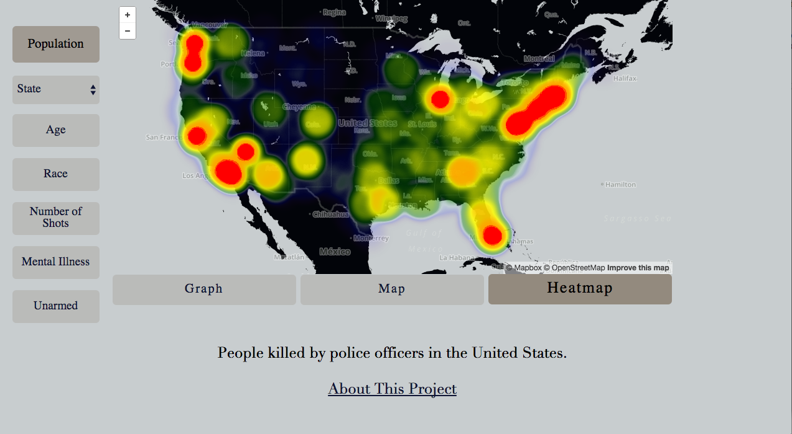
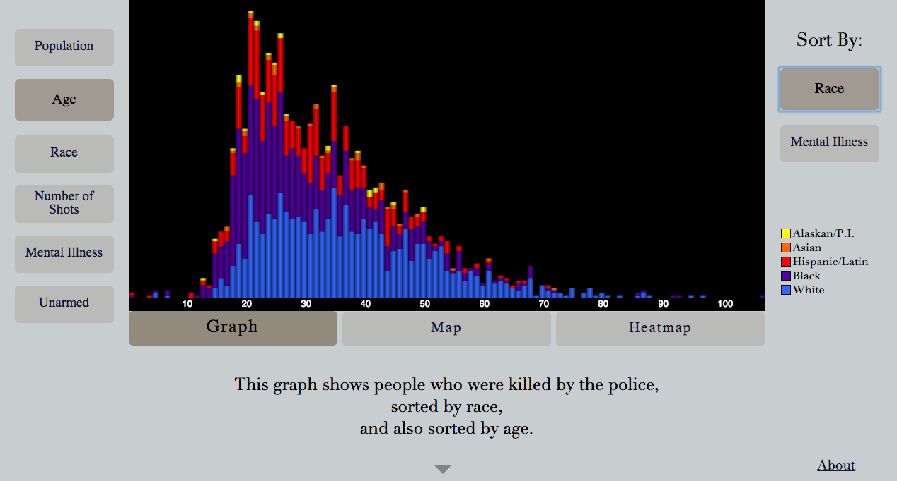
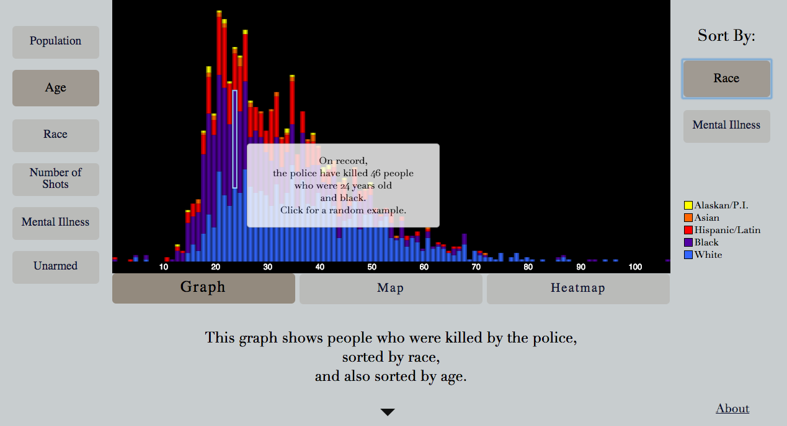
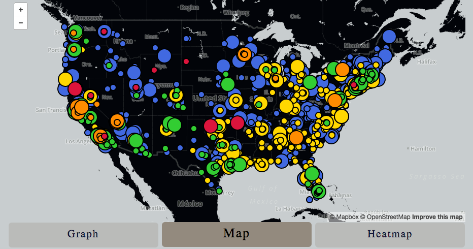
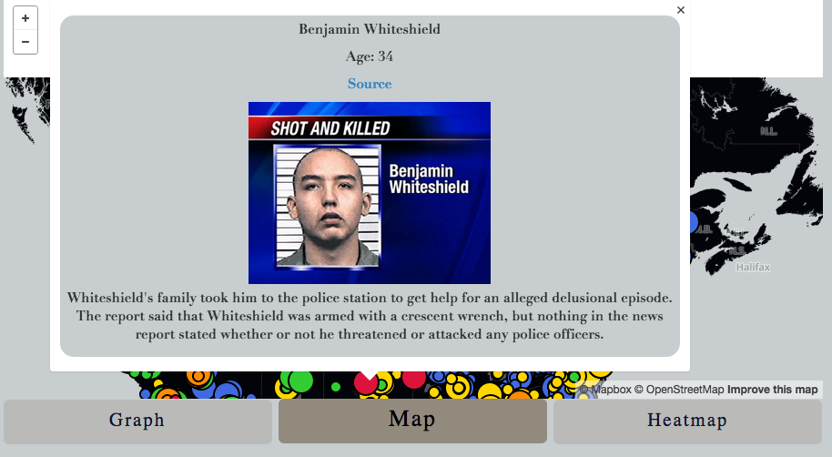

================================================================================================

This project aims to aggregate, visualize, and begin to interpret some of the scattershot existing data regarding US citizens killed by the police.

There is a huge amount of information available on this site.  For the best explanation, please click the "About This Project" link on the main page.

To run locally after you've cloned, try: 

	bundle install
	rake db:create_db
	rake db:migrate
	rake db:seed_from_master
	bundle exec rackup

================================================================================================

================================================================================================

================================================================================================

================================================================================================

================================================================================================

